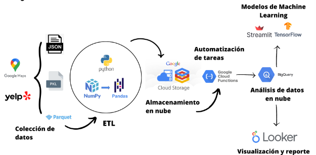

**Consultora de datos**

---

# **PROYECTO GOOGLE + YELP** ⭐️⭐️⭐️⭐️⭐️

## **¿Quienes Somos?** 👥

_Somos una consultora ficticia de análisis de datos, llamada **ANALYTIX**. Nuestro proyecto se centra en analizar la información recopilada de plataformas de reseñas como Yelp y Google Maps. Nuestro objetivo principal es descubrir patrones y tendencias en las reseñas de los usuarios, con el fin de comprender su experiencia, necesidades y expectativas en relación a los diferentes servicios._

_Este análisis de datos nos permite proporcionar un análisis detallado basado en los datos recopilados, brindando asesoría y recomendaciones a posibles inversores hipotéticos interesados en este proyecto. Esta información resultaría sumamente valiosa para la toma de decisiones estratégicas y para mejorar la imagen y reputación del negocio consultado._


---

## **Nuestro Producto: ReviewTrends** 🚀🚀🚀

_Es una solución integral que combina análisis avanzado, machine learning y estrategias de gestión de la reputación para garantizar la disponibilidad de datos limpios y estructurados, provenientes de plataformas de reseñas como Yelp y Google Maps. Nuestro objetivo es brindar información relevante y confiable para respaldar la toma de decisiones estratégicas tanto en la gestión de la reputación como en la inversión en negocios rentables._


## **Componentes del Producto** 🚀

- [Tablero de Métricas](https://lookerstudio.google.com/reporting/53e7c271-dfda-4053-9dc9-537dc6c55815)

  _Tablero interactivo que muestra las métricas clave de manera visualmente atractiva y fácil de entender, permitiendo a los usuarios monitorear y analizar de manera efectiva el desempeño de los negocio en función de datos relevantes._

  [Vista Previa del Tablero](src/videos/Video%20Tablero.mp4)

- [Modelos de Machine Learning ]()

  **Modelo de Machine Learning para predecir el rating futuro de los negocios:** _Desarrollamos un modelo de Machine Learning que utiliza técnicas de análisis de datos para predecir el rating que los negocios obtendrán en el futuro. Proporciona una estimación precisa del rendimiento esperado de un negocio en términos de calificaciones y reseñas._

  **Red Neuronal para identificar las especificaciones clave de los negocios exitosos:** _Hemos creado una red neuronal para identificar las características y especificaciones que deben tener los negocios exitosos._

  [Vista Previa de los Modelos](src/videos/Video%20Tablero.mp4)

---

## **¿Como lo hicimos Posible?** 🔥🔥🔥

**1-** _Extracción y transformación de datos con python usando las librerias Pandas y Numpy principalmente._

**2-** _Almacenamiento de datos limpios y estructurados con el servicio en la nube Google Cloud Storage_

**3-** _Análisis de datos en la nube conn BigQuery_

**4-** _Modelos de Machine Learning con las librerias de Scikit-learn, Keras y TensorFlow, deployados con la libreria Streamlit_

**5-** _Visualización y reportes con Google Data Looker conectado desde BigQuery_



**Estructura del Pipelines**

---

## **Documentos adicionales en este proyecto** 📚

- [Informes de Cada Sprint](https://github.com/Davoassassin27/PROYECTO-GRUPAL-GOOGLE-YELP/tree/main/Material_Sprints)
- [Diccionario de datos](https://github.com/Davoassassin27/PROYECTO-GRUPAL-GOOGLE-YELP/blob/main/Diccionario_de_Datos.ipynb)
- [Archivo de ETL](https://github.com/Davoassassin27/PROYECTO-GRUPAL-GOOGLE-YELP/blob/main/ETL.ipynb)
- [Notebook Modelo de Prediccion]()
- [Notebook Modelo de redes Neuronales]()
- [Notebook Exploración de datos para Dashboard]()

---

## **Clona este repositorio**👍

Conoce nuestro proyecto, clonando el repositorio en tu computador

```bash
  git clone https://github.com/Davoassassin27/PROYECTO-GRUPAL-GOOGLE-YELP
```

---

## **Autores** 👥🖋️

- David Soler, Data Scientist - [@Davoassassin27](https://github.com/Davoassassin27)
- Juan Arrieta, Data Scientist - [@Juan1401123](https://github.com/Juan1401123)
- Ana María García Arias, Data Analytics - [@Nany1993](https://github.com/Nany1993)
- Matías Cejas, Data Engineer - [@Matias-Cejas](https://github.com/Matias-Cejas)
- Luis Bouchez, Data Engineer - [@LuisBouchez](https://github.com/LuisBouchez)

---

## **Herramientas** 🛠

Python, Streamlit, Google Data Looker, Google Cloud Storage, BigQuery, TensorFlow, Keras

---

## **Video del Producto** 📷

[Video Explicativo](http/)
